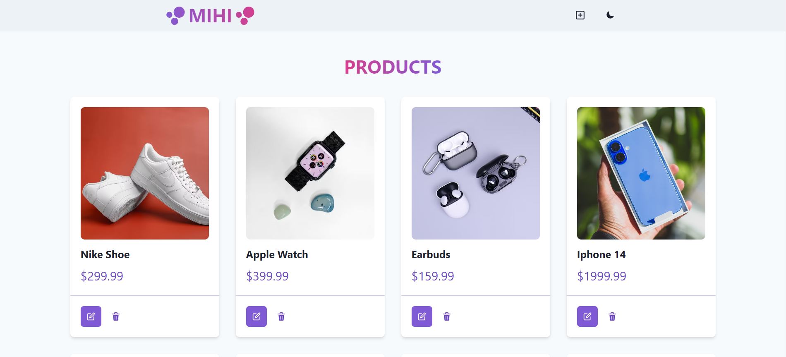

# Product Catalog App

Catalog app is a product management application that allows users to list, update, and delete products. It is built using the MERN stack and provides a modern user interface for easy management.

## Overview

This app, allows users to manage a list of products by viewing, adding, updating, and deleting them. The goal is to offer a simple and efficient product management tool for small businesses or e-commerce platforms.

## Features

- Product listing and detailed view
- Add, edit, and delete products
- Responsive design
- Dark and light theme support
- Optimized performance with state management

## Technologies Used

### Frontend

- **React**: Frontend library for building the UI
- **Chakra UI**: UI component library for responsive design
- **React Router**: For client-side routing
- **Zustand**: State management
- **Framer Motion**: Animations for a smooth user experience
- **ESLint**: For code quality and linting

### Backend

- **Node.js**: JavaScript runtime environment for backend
- **Express.js**: Web framework for building APIs
- **MongoDB & Mongoose**: NoSQL database and object data modeling (ODM)

### Screenshoots

